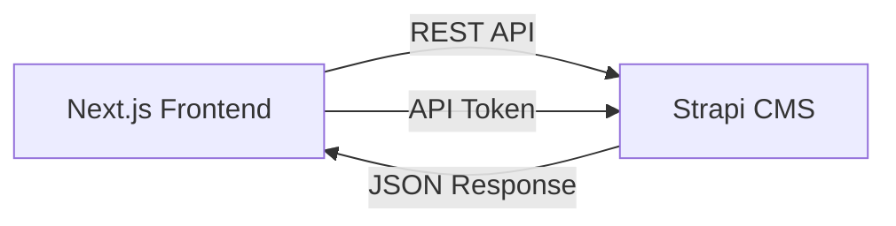

# Frontend to Strapi Connection Guide

This document outlines the architecture and implementation details for the connection between the Next.js frontend and the Strapi Headless CMS.

## Architecture Overview

The integration follows a decoupled architecture where Next.js acts as the presentation layer, fetching content and data from Strapi via its REST API.



## Setup & Configuration

### Environment Variables

The connection requires two main environment variables, configured in `.env.local`:

- `NEXT_PUBLIC_STRAPI_URL`: The base URL of your Strapi instance (e.g., `http://localhost:1337`).
- `STRAPI_API_TOKEN`: A Full Access or Custom API token generated in the Strapi Admin panel (Settings -> API Tokens).

> [!IMPORTANT]
> The `STRAPI_API_TOKEN` should never be prefixed with `NEXT_PUBLIC` to ensure it remains server-side only and is not leaked to the browser.

### API Client

The core connection logic is encapsulated in `lib/strapi-api.ts`.

Key features:
- **Unified Fetching**: A robust `fetchAPI` function with built-in error handling and cache management.
- **TypeScript Support**: Full typing for Strapi responses and internal data models.
- **Data Adapters**: Functions that "flatten" Strapi's highly nested JSON structure into clean, frontend-friendly objects.

## Usage Examples

### Fetching Blog Posts

```typescript
import { getBlogPosts } from "@/lib/strapi-api";

// In a Server Component
const posts = await getBlogPosts({ category: "Health Insurance" });
```

### Fetching Single Post by Slug

```typescript
import { getBlogPostBySlug } from "@/lib/strapi-api";

const post = await getBlogPostBySlug("how-to-claim-insurance");
```

## Data Adaptation

Strapi's default response often looks like this:
`data.attributes.coverImage.data.attributes.url`

Our adapter functions (`adaptBlogPost`, `adaptInsuranceProduct`) transform this into:
`post.imageUrl`

This decoupling allows the frontend UI components to remain agnostic of the CMS's internal data structure.

## Performance & Optimization

- **ISR (Incremental Static Regeneration)**: We use Next.js `tags` for cache revalidation.
- **Server Components**: Content-heavy pages (Blog List, Blog Detail) use Server Components for faster initial load and better SEO.
- **Client Components**: Interactive tools (Insurance Comparison) use Client Components for real-time filtering, while still receiving initial data from the server.

## Security Guidelines

1. **Token Protection**: Always use the API token on the server side.
2. **Error Handling**: The API client logs detailed errors server-side but returns sanitized messages to the frontend.
3. **Validation**: All data fetched from external sources is typed and default values are provided to prevent UI crashes.

## Future Enhancements
- Webhook implementation for automated cache revalidation.
- Localization support via Strapi i18n.
- Media optimization using Strapi's image transformation parameters.
